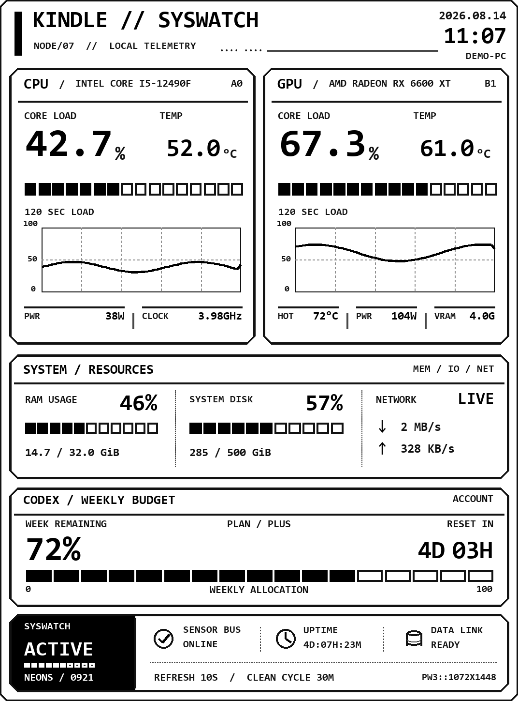

# Kindle SYSWATCH

把闲置 Kindle Paperwhite 3 改造成电脑硬件与 Codex 用量监控屏。Windows 负责采集数据并渲染 1072×1448 单色 PNG，Kindle 通过 KUAL 扩展每 10 秒下载并用 FBInk 显示，默认每 30 分钟执行一次全刷。

## 功能

- CPU、GPU 负载、温度、功耗、频率和两分钟曲线
- 内存、磁盘、网络与系统运行时间
- Codex 每周额度及重置时间
- Kindle 断线后自动重试，电脑端短时读取失败时保留最近一次 Codex 数据
- Windows 热点网关自动发现，无需在 Kindle 固定电脑 IP
- 可配置硬件名称、节点标识、刷新提示和设备型号

<p align="center">
  
</p>

## 适用环境

- Windows 10/11，Python 3.11 或更高版本
- Kindle Paperwhite 3，屏幕 1072×1448
- 已完成越狱，并安装 KUAL、MRPI、Python 3 和 FBInk/libkh
- Intel 或 AMD CPU，NVIDIA、AMD 或 Intel GPU

越狱步骤与风险说明见[完整教程](./Kindle_SYSWATCH_从越狱到监控屏完整教程.md)。越狱方法与固件版本强相关，不要跨型号照搬。

## Windows 端安装

1. 下载或克隆本仓库，以普通用户打开 PowerShell：

   ```powershell
   Set-ExecutionPolicy -Scope Process Bypass
   .\setup.ps1
   ```

   脚本会创建 `.venv`、安装 Python 依赖、下载 LibreHardwareMonitor 并编译只读传感器桥接程序。

2. 根据 [PawnIO 官方发布页](https://github.com/namazso/PawnIO.Setup/releases)安装 PawnIO，随后重启 Windows。部分硬件传感器需要管理员权限。

3. 复制示例配置并生成随机令牌：

   ```powershell
   Copy-Item .\config.example.toml .\config.toml
   $token = -join ((1..48) | ForEach-Object { '{0:x}' -f (Get-Random -Maximum 16) })
   $token
   ```

   打开 `config.toml`，替换 `auth_token`，并按本机硬件修改 `[dashboard]`。不要提交这个文件。

4. 如需显示 Codex 额度，先安装 Codex CLI 并执行 `codex login status`。没有 Codex CLI 时，其他监控模块仍可使用。

5. Kindle 连接电脑热点后，以管理员 PowerShell 创建仅允许该 Kindle 访问的防火墙规则：

   ```powershell
   .\install-firewall.ps1 -KindleMac "AA-BB-CC-DD-EE-FF"
   ```

6. 双击 `start-syswatch.cmd`。首次启动会请求 Windows 管理员权限，服务随后在后台运行。

## Kindle 端安装

1. 将 `kindle-extension/kindle-monitor` 复制到 Kindle 的 `extensions` 目录。
2. 将 `config.example.sh` 复制为 `config.sh`。
3. 把 `AUTH_TOKEN` 改成与电脑端完全相同的令牌。
4. 安全弹出 Kindle，打开 `KUAL → Kindle SYSWATCH → Start monitor`。

Kindle 连接 Windows 移动热点时可以保持 `SERVER_HOST=""`，扩展会把默认网关作为电脑地址。使用普通路由器且电脑不是默认网关时，填写电脑的局域网 IPv4 地址。

## 目录

```text
kindle-syswatch/
├─ kindle_monitor/                 # 数据采集、Codex 读取与 PNG 渲染
├─ sensor_bridge/                  # LibreHardwareMonitor 桥接程序源码
├─ kindle-extension/kindle-monitor # KUAL/FBInk 设备端扩展
├─ config.example.toml             # Windows 示例配置
├─ setup.ps1                       # Windows 环境初始化
├─ start-syswatch.cmd              # 双击启动入口
└─ Kindle_SYSWATCH_从越狱到监控屏完整教程.md
```

`runtime/`、`vendor/`、真实配置和诊断文件均为本机生成内容，不会进入版本库。

## 常见问题

- **Kindle 显示 `PC OFFLINE`**：确认电脑服务已启动、Kindle 与电脑在同一网络、8765 端口规则存在，并检查两端令牌是否一致。
- **Codex 显示 `OFFLINE`**：运行 `codex login status`。服务每分钟重试，短时失败会保留最近一次成功数据五分钟。
- **CPU 温度或功耗是 `--`**：使用管理员入口启动，确认 PawnIO 已安装且电脑已重启。某些 Ryzen 处理器还需要 AMD Ryzen Master SDK。
- **屏幕残影明显**：保留 10 秒局部刷新和 30 分钟全刷；也可以适当缩短全刷周期。

## 安全说明

- 服务使用 URL 查询令牌鉴权，但没有 HTTPS，仅应运行在可信局域网或电脑热点中。
- 不要公开 `config.toml`、Kindle 的 `config.sh`、带令牌的 URL、设备 MAC、序列号或运行日志。
- 本仓库不镜像 Kindle 越狱包、固件、KUAL、FBInk、PawnIO 或 LibreHardwareMonitor 安装包，请从各项目官方发布页获取。

## 第三方项目

- [KindleModding](https://kindlemodding.org/)
- [MobileRead Kindle Developer's Corner](https://www.mobileread.com/forums/forumdisplay.php?f=150)
- [LibreHardwareMonitor](https://github.com/LibreHardwareMonitor/LibreHardwareMonitor)
- [PawnIO.Setup](https://github.com/namazso/PawnIO.Setup)
- [FBInk](https://github.com/NiLuJe/FBInk)
